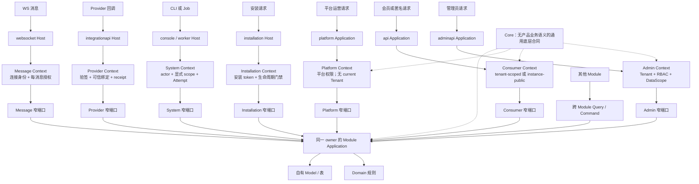

# Peanut Admin Application 与 Module 永久架构蓝图

> 文档状态：目标架构决定，尚未等同于 Runtime 已完成。
>
> 适用范围：Peanut Admin 后端源码组织、请求入口、Module、跨模块调用、依赖、非 HTTP Host 和迁移顺序。
>
> 设计冻结基线：`origin/dev@0cc1b9dd3c4fd0ff12b30f0bdcc138bcee33268a`，2026-09-01。
>
> 冻结含义：本文组是后续实施的唯一目标合同；当前 Runtime 只用于确认迁移缺口，不得反向覆盖目标设计。

## 一句话结论

Peanut Admin 应同时保留两种边界，但不能再把它们混为一谈：

- **Application 按“谁在访问、通过什么协议访问”划分**，负责入口、身份、Tenant 获取方式、权限链和响应协议；
- **Module 按“哪项业务能力、谁拥有数据和规则”划分**，负责用例、业务不变量、自有数据和公开能力。

因此，`adminapi` 和 `api` 不是两个普通目录，更不是 Article、Payment 这类业务模块。它们是两套战略级
ThinkPHP Application：管理端必须经过管理身份、Tenant、RBAC 和数据范围；消费端可以匿名或使用会员身份，
即使需要 Tenant，也不能借用管理端会话和权限链。多个入口可以共享一个业务/数据 owner，但必须调用该 owner
面向各自受众的窄端口；Context、授权、DataScope、DTO 和结果映射不能共享成万能入口。

## 这套蓝图解决什么问题

现在打开后端代码容易迷路，并不是文件数量本身造成的，而是同一项业务可能同时出现在：

- 根路由、Application 路由和 Module 路由；
- `controller`、`application`、`service`、`common/service` 和 Module `Application`；
- 全局 `AppService` 的容器绑定和各处临时 `new ModuleProvider()`；
- `adminapi`、`api` 与 Module 自己的 `Http/Controller`。

开发者无法只凭路径判断“这段代码服务谁、由谁授权、谁拥有事务、谁能改数据”。蓝图的目标不是增加更多层，
而是让路径本身回答这四个问题。

## 永久规则

1. `server/app/adminapi`、`api`、`platform` 是独立 Application，不是 Module。
2. Application 拥有最终路由、Controller、输入验证、身份链、Tenant 获取规则、入口授权和协议错误映射。
3. Module 按业务、数据 owner 和业务不变量划分，拥有用例、自有表、迁移、菜单/权限声明和公开能力。
4. “共享 Module”只共享 owner、领域规则、Repository/表和必要不变量；Admin、Consumer、Platform、Provider、
   System 使用不同窄端口、强类型 Context、授权、DataScope、DTO 和结果映射。禁止万能 CRUD、`actorType` flag、
   union Context 和任意 `attributes`。
5. Module 不拥有最终 HTTP Controller 或路由；同一 owner 可以被多个 Application、CLI、Job 或未来 WS Host 调用。
6. 每个顶层 HTTP 请求、CLI 操作、Worker Attempt、Provider callback 或未来 WS message 恰好有一个强类型权威
   Context；tenant-scoped 端口恰好有一个 current Tenant，认证、instance-public 与 Platform Context 明确
   tenantless。`TargetTenantId` 只是授权后的 Command 目标。内部调用不得重建不同 actor、audience 或 Tenant 的
   嵌套 Context。
7. Tenant ownership scope 与对象级 DataScope 是两层合同；在 tenant-scoped 端口中，两者都消费同一个 current
   Tenant，不能互相替代。
8. 跨 Module 不直接访问对方 Model、表或内部 Service；同步调用公开 Query/Command，异步只提交已登记 Job 意图。
9. 一个进程只有一个 composition root。Application/Module provider 只是启动期注册贡献者；禁止请求期 Provider
   定位、第二 root、业务 `app()`/Facade 和静态 Runtime factory。
10. 最外层事务由拥有完整业务结果的 Module Command 持有；跨 Module participant 只加入同一连接/事务且不能提交，
    外部 HTTP 永不进入数据库事务。
11. Job 是提交意图，Attempt 只在成功 claim 时创建；Consumer、Provider、System 都不得冒充 Admin。
12. 关键 `AuditEvent` 与业务结果原子提交；入口日志和诊断束只是可丢失、可重建的脱敏投影。
13. 一个部署进程只有一份 Composer/npm 依赖图和 lock；冲突在安装或构建期拒绝，不加载第二份 vendor。
14. 本蓝图明确排除通用 AOP、Event Bus、Outbox、微服务、独立队列和空 WS/Repository/Domain 层；未来真实需求
    只能通过新的架构决定显式取代本合同，不能在本蓝图实施中顺带加入。
15. 迁移按业务域硬切且任何 endpoint 不得双路由；最后一个域迁完后才关闭暂态根业务装载，最终验收清除
    Module HTTP、`backend.routes`、手工 Provider 定位和旧生成器模板。

## 目标知识图谱

## 打开目录时应该怎样理解

| 看到的路径 | 先问的问题 | 它应该包含什么 |
| --- | --- | --- |
| `app/adminapi` | 管理员怎样安全访问系统？ | 管理会话、Tenant 选择、RBAC、数据范围、管理端 Controller |
| `app/api` | 会员或匿名用户怎样访问业务？ | 会员会话、公开/会员 API、消费端 Tenant 解析、限流 |
| `app/platform` | 平台运营者怎样管理实例和 Tenant？ | Platform 身份、平台权限、跨 Tenant 控制面操作 |
| `app/Modules/.../Article` | Article 业务本身怎样工作？ | 文章用例、规则、自有表、迁移、公开查询/命令 |
| `app/common` | 是否真的是所有入口都通用？ | 无业务 owner 的底层适配、值对象和少量共享合同 |
| `app/command` / worker | 非 HTTP 操作怎样进入业务？ | 解析命令/Job、建立 Context、调用 Module，不复制业务规则 |

## 文档导航

1. [主流脚手架源码研究](reference-research.md)：LikeAdmin、LikeAdmin SaaS、MineAdmin、BuildAdmin、Hyperf 的真实组织方式、优点和代价。
2. [目标架构与完整执行流程](target-architecture.md)：Application、Module、HTTP、回调、Job、WS、权限和可观测性如何协作。
3. [目录、调用与依赖规范](module-conventions.md)：每个目录放什么、跨 Module 怎么调、何时用 static/public/private、第三方包冲突怎么办。
4. [现状差距与一次收敛路线](adoption-roadmap.md)：暂态边界、最小工作包、依赖、最低验证和停止线如何收敛。

## 当前事实与目标的边界

当前 Runtime 已具备可复用基础：管理端、消费端、Platform 目录已经存在；执行 Context 生命周期、Module manifest、
权限/菜单声明、部分 Application Service 和容器绑定也已存在。应用 Composer 已锁定
`peanut-admin/core@0.1.0-alpha.12`，source reference 为
`9017212da0da63f445d693be94d533f681c6dc92`。Alpha.12 的 manifest schema 已移除 `backend.routes`；
这只关闭该字段的采用前置，不证明目标多应用装载已经完成。

但目标架构**尚未整体落地**：当前 Composer 未登记 `topthink/think-multi-app`，`server/route/app.php` 仍统一加载
Admin、API、Platform、Tenant 和 Module 路由，Module 仍包含 HTTP Controller/route，运行时也仍有多处手工
`new ModuleProvider()`。因此本文只能作为后续实现的唯一目标，不得据此宣称架构改造已经完成。

正式可消费源码、Tag、Release 与登记 Demo 仍是 `v3.0.12`。仓库中的 `v3.0.13` 元数据处于
`pending qualification`：没有最终 candidate commit/tree、没有 P0-E 通过、没有 Tag、GitHub Release 或部署；
它不能作为本架构已交付、已资格或已采用的证据。

旧的 `optimized-module-architecture-plan.md` 和 `module-architecture-refinement-appendix.md` 把 Module 同时当成
业务边界和 HTTP Host，已经不能继续作为源码组织目标；其中包完整性、生命周期和 catalog 的有效设计仍由
`consumer-module-lifecycle-contract.md` 及现行命令事实承接。

## 判断新代码放在哪里

只按下面的顺序判断，不需要背更多概念：

1. 代码是否只负责某种入口的身份、协议或响应？放对应 Application。
2. 代码是否表达某项业务规则或修改某个业务 owner 的数据？放对应 Module。
3. 代码是否协调多个 Module 完成一个入口专属流程？放调用方 Application 的 `application/`，但不得接管 owner
   Module 的业务事务。
4. 代码是否被多个入口复用但仍有产品业务含义？明确一个 owner Module，并为不同受众提供不同窄端口和 DTO。
5. 代码是否被多个 Module 复用但仍有产品业务含义？明确一个 owner Module，其他模块调用其公开能力。
6. 只有完全不含产品语义、确实被多处复用的能力，才进入 `common` 或 Core。

这六问无法给出唯一答案时，说明 owner 还没有定义清楚，不应先创建新目录或抽象。
