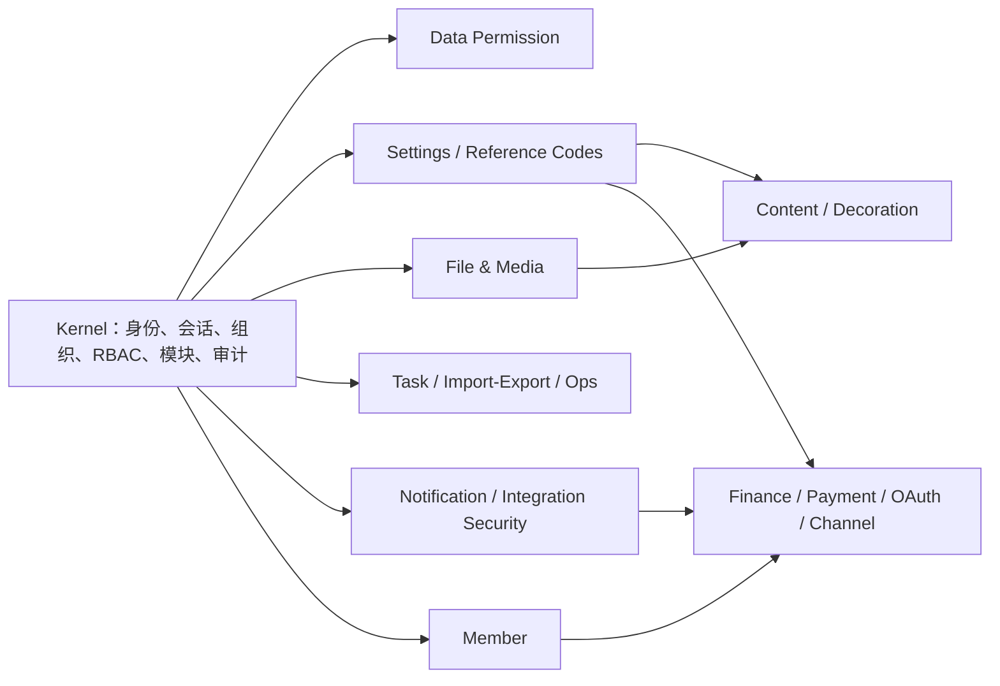

# 核心包与应用能力图

> 状态：PB03 已冻结
>
> 日期：2026-08-11
> 范围：产品能力所有权，不要求 UI、路由、接口名称或响应外壳相同

## 1. 当前事实

应用已经从公开 registry 安装 `peanut-admin/core` 和 `@peanut-admin/admin`，但当前只消费 PHP 权限集合原语与 override registry、Web 权限 helper 与空 override registry，以及 PC/UniApp 的请求、认证与错误处理客户端。PHP 的 LikeAdmin URI 权限策略默认实现仍在应用；大多数已验收业务仍由应用仓的 ThinkPHP Logic/Service 和 Vue 页面直接实现。

核心 Composer 包当前包含 `kernel`、`data-permission`、`settings`、`reference-codes`、`file-media`、`task-job`、`notification-sms`、`import-export`、`ops-console` 和 `integration-security` 十个内部模块；npm 总包具有对应子路径以及 `core`、`shell`、`client`、`client/nuxt`、`client/uniapp`。这些目录是一个包内的模块，不新增公开包。除已固定 P0/Host 边界外，上述 P1 领域 Runtime 仍是候选，不能从“源码存在”推导为应用已获准消费。

完整所有权、测试 owner、逐领域合同与停止线见 `docs/architecture/pb03-ownership-and-migration-gates.md`。

## 2. 能力和依赖关系

收口顺序必须遵守依赖方向：先完成 Kernel Host 和系统基础设施，再收口应用会员/财务，随后收口内容/装修，最后处理通知、支付、OAuth 与外部渠道。会员、内容、装修、财务、支付和 OAuth 是应用 Module，不迁产品模型到核心；不得为了并行在上下游同时建立临时双实现。

## 3. 领域所有权矩阵

| 领域 | 应用当前实现 | 核心当前能力 | 正式基线目标 |
|---|---|---|---|
| 登录、管理员、角色、部门、岗位、菜单 | 应用 Logic/Model 完整实现；权限 Host/override 与管理员/RBAC CRUD 均已收口并有应用测试 owner | Kernel 已有多租户身份、会话、组织、RBAC、菜单、审计 | 核心拥有通用原语；应用拥有单租户管理员模型、LikeAdmin URI 语义、CRUD 事务与 ThinkPHP Host；不迁 Tenant schema |
| 配置、支付配置、渠道配置 | `ConfigService` 与多组 Setting Logic | Settings 已有定义、作用域、校验、密钥保护和 `pa_setting_*` PDO 存储候选 | 应用拥有 key/schema/default 和 `pa_config`；核心候选获准且存储/schema 合同明确后才切换通用用例 |
| 字典 | `pa_dict_type/pa_dict_data`、LikeAdmin CRUD/状态/选择器与 HTTP/UI 的唯一 Runtime | Tenant 三表、不可变 code、版本追加、ETag/幂等 Reference Codes 候选 | 当前 schema/API 不等价且核心无下游采用授权；PB04-03 保留应用唯一实现，不双写、不 deep import |
| 文件、素材、存储引擎 | `pa_file*`、公开素材 URL、分类/选择器和 local/qiniu/aliyun/qcloud 唯一 Runtime；`storage` 同时决定 URL 与删除 Provider | Tenant-private `pa_file_object`、archive、delivery grant 与 local-private 候选 | 当前可见性/schema/生命周期不等价且核心无采用授权；应用不双写、不 deep import，产品引用 provenance 延后各表 owner |
| 定时任务、生成器、导入导出、日志、维护 | Crontab/Generator/OperationLog/System；PB04 已收口任务、XLSX、脱敏审计和只读环境探针 | Tenant Task Job、私有 CSV Import Export、platform Ops Console 候选 | 当前 audience/schema/重试/日志/文件语义不等价且核心无采用授权；应用保留唯一 Runtime，不双写、不 deep import |
| 通知与短信 | 四个固定验证码 Scene、`NoticeChannelService`、Log/SMS；通用模板/SMTP Runtime 已退出 | Tenant message/outbox/Task 重试型 Notification SMS 与 Integration Security 候选，已发布但无应用采用授权 | PB07 通知切片保留应用唯一 Runtime：产品 scene、频控/消费、短信凭据、Provider 和同步结果均归应用；不升级依赖、不 deep import，未来采用须有新资格与显式决策 |
| 会员、标签、余额 | Member/MemberTag/AccountLog/Recharge/Refund；`MemberBalanceService` 是唯一余额与流水 writer | Kernel 有 Tenant membership 与 R01/R02 事务/幂等/审计候选，不是客户财务模型且无下游采用授权 | PB05 保留应用 Member/Finance Module 唯一 Runtime；`user_money` 权威、`balance` 镜像，充值/退款防重留在产品 Host |
| 文章、分类、搜索 | Article/ArticleCate/Search；`ProductAssetReferenceService` 固定产品资源 provenance | 暂无产品内容模块；可复用设置/文件/任务原语 | PB06 保留应用 Content Module 唯一 Runtime，拥有发布/分类/收藏/计数与搜索规则 |
| 移动/PC/Tabbar 装修 | Decoration Logic；管理端/API/PC/UniApp 共用 `DecorationReadService` | Web Shell/client 只有通用宿主能力 | PB06 保留应用 Decoration Module 唯一 Runtime，拥有 Schema、DTO 与即时渲染结果；三端不得复制状态机 |
| 充值、退款、支付 | `PaymentServiceFactory` 唯一装配预支付、回调与退款；Recharge/Refund 状态机和余额事务由应用拥有 | 无支付 Runtime；Integration Security 仅为 Tenant 机器身份/Webhook/会话候选且无应用采用授权 | PB07 支付切片保留应用 Finance/Payment Module 唯一 Runtime；可信渠道事件才能结算，微信/支付宝响应验签，核心不得写产品订单/余额 |
| 微信 OAuth、公众号、小程序、开放平台 | `OAuthLogic`、唯一微信 transport、三个独立配置模型和固定 callback bridge；旧 Channel/AES 写入口已退出 | Integration Security 候选可复用签名/密钥能力，但无下游采用授权 | PB07 保留应用 Channel/OAuth Module 唯一 Runtime；state/ticket 单次消费，PC/公众号固定回跳，核心不得写产品身份或渠道配置 |

## 4. 唯一实现门禁

一个领域只有同时满足以下条件才算迁移完成：

1. 先确定唯一 owner；只有核心 owner 的通用能力才要求核心包导出稳定 interface/DTO/错误/状态和默认用例。
2. 默认实现有聚焦测试，覆盖权限、异常、事务、并发或幂等中的实际风险项。
3. 应用从 registry 版本消费，不使用 path repository 或源码复制。
4. 应用只通过单一 Host/override 注册装配依赖。
5. 应用内与核心重复的实现被删除；应用 owner 的产品域则在应用 Module 内收口，搜索和依赖图中不存在第二条可运行路径。
6. 对应业务做一次最低充分 API/数据库或浏览器验收，并更新契约与文档。

## 5. 首个实施切片

PB04 已从网站设置唯一实现开始，而不是直接迁移全部系统页面：

- 真实表是 `pa_config`，网站组为 `type=website`；不存在 `pa_system_config`。
- 核心现有 Settings 直接依赖 `final PdoSettingRepository` 与 `pa_setting_*` schema，并非可供 `pa_config` 实现的稳定存储端口；为首片抽象它会改变平台操作员、Tenant/target、revision/ETag 和 P1 audience。
- 已选择应用 owner 路线：`WebsiteConfigService` 拥有字段/规则/标准化，`WebsiteConfigStore` 是应用内部端口，`PaConfigWebsiteStore` 是唯一生产 adapter；不改核心 Runtime、不双写。
- 本片只处理网站基础设置的读取、校验和保存，未修改登录、支付、渠道、协议、版权或默认头像。
- 应用 owner `PB04-SETTINGS-WEBSITE-001` 的聚焦测试与一次真实数据库读取/合法保存/非法不写/恢复原值均已通过。

该切片证明应用 owner 能通过单一服务和存储端口删除规则重复。随后 PB04 系统域、PB05 会员/财务与 PB06 内容/装修均已由各自 owner 固定；内容资源保留原 Provider provenance，管理端与三端共用唯一装修读取 DTO。PB07 通知、支付、OAuth 与外部渠道也已固定应用唯一 Host、产品状态机、回跳与外部结果安全边界；下一步进入 PB08A 脚手架产品化与官方网站门禁，不提前开始 SaaS。
