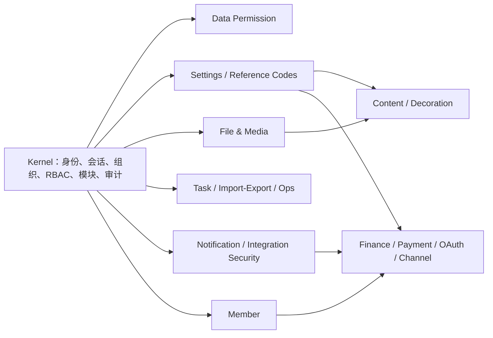

# 核心包与应用能力图

> 状态：PB03 冻结输入
>
> 日期：2026-08-11
> 范围：产品能力所有权，不要求 UI、路由、接口名称或响应外壳相同

## 1. 当前事实

应用已经从公开 registry 安装 `peanut-admin/core` 和 `@peanut-admin/admin`，但当前只消费 PHP 权限策略、Web 权限 helper、覆盖注册表，以及 PC/UniApp 的请求、认证与错误处理客户端。大多数已验收业务仍由应用仓的 ThinkPHP Logic/Service 和 Vue 页面直接实现。

核心 Composer 包当前包含 `kernel`、`data-permission`、`settings`、`reference-codes`、`file-media`、`task-job`、`notification-sms`、`import-export`、`ops-console` 和 `integration-security` 十个内部模块；npm 总包具有对应子路径以及 `core`、`shell`、`client`、`client/nuxt`、`client/uniapp`。这些目录是一个包内的模块，不新增公开包。

## 2. 能力和依赖关系

迁移顺序必须遵守依赖方向：先完成 Kernel Host 和系统基础设施，再迁移会员，随后迁移内容与财务，最后处理支付、OAuth 与外部渠道。不得为了并行在上下游同时建立临时双实现。

## 3. 领域所有权矩阵

| 领域 | 应用当前实现 | 核心当前能力 | 正式基线目标 |
|---|---|---|---|
| 登录、管理员、角色、部门、岗位、菜单 | 应用 Logic/Model 完整实现；仅权限判断接入包 | Kernel 已有身份、会话、组织、RBAC、菜单、审计 | 核心拥有规则/用例/权限；应用提供 ThinkPHP Controller、请求映射与持久化桥接 |
| 配置、支付配置、渠道配置 | `ConfigService` 与多组 Setting Logic | Settings 已有定义、作用域、校验、密钥保护和 PDO 存储 | 先抽象存储端口，核心注册标准配置定义；应用只提供 `pa_system_config` 适配与项目值 |
| 字典 | DictType/DictData Logic | Reference Codes | 核心拥有编码不变量与用例；应用保留 HTTP 装配 |
| 文件、素材、存储引擎 | File/FileCate/Upload/Storage | File & Media 有元数据、存储端口和私有交付 | 统一元数据与生命周期契约；云厂商适配器可由应用覆盖 |
| 定时任务、生成器、导入导出、日志、维护 | Crontab/Generator/OperationLog/System | Task Job、Import Export、Ops Console | 核心拥有任务状态、导出、运维查询和脱敏规则；应用注入执行器与环境探针 |
| 通知与短信 | Scene/Template/Log/Sms | Notification SMS 与 Integration Security | 核心拥有模板、发送状态、验证码和服务商端口；应用只配置/覆盖提供商 |
| 会员、标签、余额 | Member/MemberTag/AccountLog | Kernel 有通用账户/成员，但没有当前单租户会员财务模型 | 在同一 Composer 包增加标准 Member 内部模块；先固定余额权威字段和事务端口 |
| 文章、分类、搜索 | Article/ArticleCate/Search | 暂无标准内容模块 | 增加 Content 内部模块；核心拥有发布/分类/收藏/计数规则，应用保留存储与 HTTP 映射 |
| 移动/PC/Tabbar 装修 | Decoration Logic 与三端消费 | Web Shell/client 只有通用宿主能力 | 增加 Decoration 契约、Schema 与 DTO；端特有编辑器/渲染组件仍在对应前端子路径 |
| 充值、退款、支付 | Recharge/Refund/Payment Service | 有事务、幂等、安全与通用集成基础，暂无现行业务模型 | 增加 Finance/Payment 内部模块；核心拥有金额、状态机、幂等和回调验签，支付渠道由覆盖注入 |
| 微信 OAuth、公众号、小程序、开放平台 | 应用 Service/Logic 完整实现 | Integration Security 可复用签名/密钥能力 | 增加 Channel/OAuth 内部模块；核心拥有 state/ticket/绑定冲突和回调顺序，应用注入微信传输 |

## 4. 唯一实现门禁

一个领域只有同时满足以下条件才算迁移完成：

1. 核心包导出稳定 interface/DTO/错误/状态和默认用例。
2. 默认实现有聚焦测试，覆盖权限、异常、事务、并发或幂等中的实际风险项。
3. 应用从 registry 版本消费，不使用 path repository 或源码复制。
4. 应用只通过单一 Host/override 注册装配依赖。
5. 应用内原业务实现被删除；搜索和依赖图中不存在第二条可运行路径。
6. 对应业务做一次最低充分 API/数据库或浏览器验收，并更新契约与文档。

## 5. 首个实施切片

PB04 从“设置存储端口与标准配置定义”开始，而不是直接迁移全部系统页面：

- 核心 Settings 从具体 PDO Repository 后面提取稳定存储契约，现有 PDO 实现继续作为默认实现。
- 应用提供 ThinkPHP/`pa_system_config` 适配器，通过 PHP 覆盖 Host 注册。
- 先迁移网站基础设置这一组读取、校验和保存用例，删除对应应用 Logic 中的规则重复。
- 只验收网站配置读取、一次合法保存、一次非法输入不写入、覆盖注册和恢复原值。

该切片证明“核心唯一实现 → registry 发布 → 应用消费 → 删除重复逻辑”的完整链路。通过后再扩展同一设置域，不在首片同时修改会员、支付或渠道。
