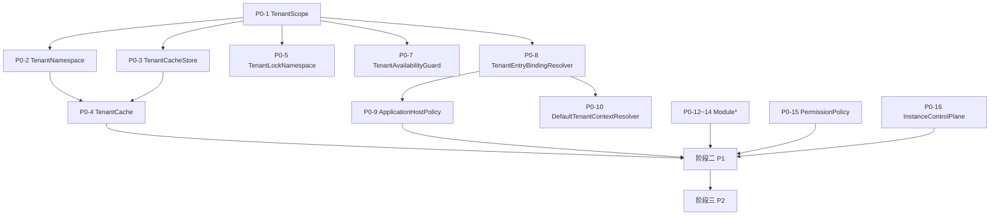

# 核心代码下沉操作指南

> **目标**：将脚手架中 `app-owned` 的框架桥接代码下沉到核心库，使派生应用只保留真正的业务代码。
>
> **执行模型**：Gemini 3.7 Flash（批量逐文件迁移）/ Gemini 3.1 Pro（复杂架构决策时升级）
>
> **涉及仓库**：
> - 应用仓库：`peanut-admin`（脚手架 + 应用）
> - 后端核心库：`peanut-admin/core`（Composer 包）
> - 前端核心库：`@peanut-admin/admin`（npm 包）

---

## 前置约束

> [!CAUTION]
> 1. 核心库是独立发布的包，修改核心库后必须发布新版本，应用才能通过 `composer update` / `pnpm update` 消费
> 2. 下沉后必须保持向后兼容：现有应用不改一行代码也能工作
> 3. ThinkPHP 适配器（如 `ThinkPhpTenantCacheStore`）依赖 ThinkPHP Facade，只能留在应用层或提供为可选适配器包
> 4. 每次迁移都是一个独立 PR，包含核心库变更 + 应用层消费变更 + 脚手架模板更新

---

## 通用迁移模式

每个文件的迁移都遵循以下 5 步模式：

### 步骤 1：在核心库中创建目标文件

```
位置: peanut-admin/core/{子包}/src/{对应路径}.php
命名空间: PeanutAdmin\{子包}\{路径}
```

**规则**：
- 保持类/接口的公共 API 完全不变
- 移除所有 ThinkPHP Facade 依赖（`think\facade\Db`、`think\facade\Cache`、`think\facade\Config`）
- 如果原代码依赖 ThinkPHP Facade，改为构造函数注入 PDO 或自定义接口
- 如果原代码引用 `app\common\service\*` 命名空间下的其他类，先检查该类是否也在迁移清单中

### 步骤 2：在应用层创建薄适配器（如需要）

如果原代码依赖 ThinkPHP 特性（Facade、ORM），则在应用层保留一个薄适配器：

```php
<?php
declare(strict_types=1);

namespace app\common\service\tenant;

// 旧的直接实现变成对核心库的委托
use PeanutAdmin\Kernel\Tenancy\TenantScope as CoreTenantScope;

/**
 * @deprecated 直接使用 PeanutAdmin\Kernel\Tenancy\TenantScope
 */
final readonly class TenantScope
{
    // 如果签名完全兼容，可以直接 class_alias 或 use ... as
}
```

**如果代码不依赖 ThinkPHP**：直接删除应用层文件，所有调用方改为 `use PeanutAdmin\...`。

### 步骤 3：全局替换调用方的 `use` 语句

```bash
# 在应用仓库中查找所有引用旧命名空间的文件
grep -r "use app\\common\\service\\tenant\\TenantScope" server/app/ --include="*.php" -l

# 批量替换
sed -i '' 's/use app\\common\\service\\tenant\\TenantScope/use PeanutAdmin\\Kernel\\Tenancy\\TenantScope/g' <files>
```

### 步骤 4：更新脚手架模板清单

在 `scaffold/application-template-inventory.json` 中：
- 纯框架文件：**删除该条目**（不再由脚手架生成，而是由 `composer require` 获取）
- 薄适配器文件：保持 `app-owned`，但在注释中标注 `deprecated-bridge`
- 如果该文件此前是 `app-owned`，且其他 `app-owned` 文件中有被消费者自定义可能，保留为 `app-owned`

### 步骤 5：验证

```bash
# 1. 核心库单元测试
cd peanut-admin-core && composer test

# 2. 应用层集成测试
cd peanut-admin/server && php think test

# 3. 确认无残留引用
grep -r "app\\\\common\\\\service\\\\tenant\\\\TenantScope" server/app/ --include="*.php"
# 期望：0 结果

# 4. 前端构建（如果是前端迁移）
cd peanut-admin/web && pnpm build
```

---

## 阶段一 P0：纯框架基础设施（16 个文件）

这些文件**零业务逻辑**，可以无条件移入核心库。

### 后端 P0-1：`tenant/TenantScope.php`

| 项 | 值 |
|---|---|
| 源路径 | `server/app/common/service/tenant/TenantScope.php` |
| 目标路径 | `kernel/src/Tenancy/TenantScope.php` |
| 目标命名空间 | `PeanutAdmin\Kernel\Tenancy\TenantScope` |
| ThinkPHP 依赖 | ❌ 无 |
| 迁移方式 | **直接移动**：改命名空间，应用层删除原文件，全局替换 `use` |
| 调用方数量 | 需执行 `grep` 确认 |

**迁移操作**：
```
1. 将 TenantScope.php 复制到核心库 kernel/src/Tenancy/
2. 修改命名空间为 PeanutAdmin\Kernel\Tenancy
3. 在应用层删除 server/app/common/service/tenant/TenantScope.php
4. grep 全部调用方，替换 use 语句
5. 从 scaffold/application-template-inventory.json 中删除该文件条目
```

### 后端 P0-2：`tenant/TenantNamespace.php`

| 项 | 值 |
|---|---|
| 源路径 | `server/app/common/service/tenant/TenantNamespace.php` |
| 目标路径 | `kernel/src/Tenancy/TenantNamespace.php` |
| 目标命名空间 | `PeanutAdmin\Kernel\Tenancy\TenantNamespace` |
| ThinkPHP 依赖 | ❌ 无 |
| 内部依赖 | 引用 `TenantScope`（P0-1 已迁移） |
| 迁移方式 | **直接移动**：必须在 P0-1 之后执行 |

### 后端 P0-3：`tenant/TenantCacheStore.php`（接口）

| 项 | 值 |
|---|---|
| 源路径 | `server/app/common/service/tenant/TenantCacheStore.php` |
| 目标路径 | `kernel/src/Tenancy/TenantCacheStore.php` |
| 目标命名空间 | `PeanutAdmin\Kernel\Tenancy\TenantCacheStore` |
| ThinkPHP 依赖 | ❌ 无（纯接口） |
| 迁移方式 | **直接移动** |

### 后端 P0-4：`tenant/TenantCache.php`

| 项 | 值 |
|---|---|
| 源路径 | `server/app/common/service/tenant/TenantCache.php` |
| 目标路径 | `kernel/src/Tenancy/TenantCache.php` |
| 目标命名空间 | `PeanutAdmin\Kernel\Tenancy\TenantCache` |
| ThinkPHP 依赖 | ⚠️ 构造 `ThinkPhpTenantCacheStore`（但这是工厂方法 `thinkPhp()`） |
| 处理方式 | 将 `thinkPhp()` 静态工厂方法**移除**或改为接受外部注入。ThinkPHP 适配器留在应用层 |
| 迁移方式 | **移动 + 修改工厂** |

**详细操作**：
```php
// 核心库版本：移除 thinkPhp() 工厂，改为纯构造函数注入
final class TenantCache
{
    public function __construct(
        private readonly TenantScope $scope,
        private readonly TenantCacheStore $store
    ) {}
    // get/set/delete 方法不变
}

// 应用层保留一个工厂方法（可选）：
// app\common\service\tenant\TenantCacheFactory::thinkPhp(TenantScope $scope): TenantCache
```

### 后端 P0-5：`tenant/TenantLockNamespace.php`

| 项 | 值 |
|---|---|
| 源路径 | `server/app/common/service/tenant/TenantLockNamespace.php` |
| 目标路径 | `kernel/src/Tenancy/TenantLockNamespace.php` |
| ThinkPHP 依赖 | ❌ 无 |
| 迁移方式 | **直接移动** |

### 后端 P0-6：`tenant/ThinkPhpTenantCacheStore.php`

| 项 | 值 |
|---|---|
| 源路径 | `server/app/common/service/tenant/ThinkPhpTenantCacheStore.php` |
| 目标路径 | ⚠️ **不移入核心库** |
| ThinkPHP 依赖 | ✅ 是（`use think\facade\Cache`） |
| 处理方式 | 保留在应用层，但命名空间不变。它实现核心库的 `TenantCacheStore` 接口 |

> [!IMPORTANT]
> **这是一个关键模式**：纯逻辑 → 核心库；框架适配器 → 留在应用层。
> 后续所有依赖 ThinkPHP Facade 的代码都遵循此模式。

### 后端 P0-7：`tenant/TenantAvailabilityGuard.php`

| 项 | 值 |
|---|---|
| 源路径 | `server/app/common/service/tenant/TenantAvailabilityGuard.php` |
| 目标路径 | `kernel/src/Tenancy/TenantAvailabilityGuard.php` |
| ThinkPHP 依赖 | ❌ 无（已通过构造函数注入 `TenantRepository`） |
| 迁移方式 | **直接移动** |

### 后端 P0-8：`tenant/TenantEntryBindingResolver.php`

| 项 | 值 |
|---|---|
| 源路径 | `server/app/common/service/tenant/TenantEntryBindingResolver.php` |
| 目标路径 | `kernel/src/Tenancy/TenantEntryBindingResolver.php` |
| ThinkPHP 依赖 | ⚠️ `production()` 工厂使用 `Db::connect()` 获取 PDO |
| 处理方式 | 核心库版本只接受 `PDO` 构造注入（已经支持）。将 `production()` 工厂留在应用层适配器 |
| 迁移方式 | **移动 + 拆分工厂** |

### 后端 P0-9：`tenant/ApplicationHostPolicy.php`

| 项 | 值 |
|---|---|
| 源路径 | `server/app/common/service/tenant/ApplicationHostPolicy.php` |
| 目标路径 | `kernel/src/Host/ApplicationHostPolicy.php` |
| ThinkPHP 依赖 | ⚠️ `production()` 工厂使用 `Config::get()` |
| 处理方式 | 核心库版本纯构造注入。`production()` 留在应用层 |

### 后端 P0-10：`tenant/DefaultTenantContextResolver.php`

| 项 | 值 |
|---|---|
| 源路径 | `server/app/common/service/tenant/DefaultTenantContextResolver.php` |
| 目标路径 | `kernel/src/Tenancy/DefaultTenantContextResolver.php` |
| ThinkPHP 依赖 | ⚠️ `Db::name('tenant')` |
| 处理方式 | 核心库版本接受 PDO 注入，应用层工厂桥接 |

### 后端 P0-11：`tenant/TenantSettingService.php`

| 项 | 值 |
|---|---|
| 源路径 | `server/app/common/service/tenant/TenantSettingService.php` |
| 目标路径 | ⚠️ **暂不移入核心库** |
| 原因 | 引用了 `app\common\service\member\*`（业务层类），且使用 `Db::name()` |
| 处理方式 | 保留在应用层。当 member 服务也完成下沉后，再考虑 |

### 模块执行层：保留在应用

`module/ModuleExecutionContext.php`、`ModuleExecutionGuard.php` 和
`OfficialModuleMiddleware.php` 不属于 P0：前者依赖应用业务会员 Context，后两者分别
承载应用 Module Runtime 与 ThinkPHP HTTP bridge。核心库已有 Module 契约；应用继续作为
这些契约的 Host，不创建同名核心副本。

### 后端 P0-15：`permission/RegisteredAdminPermissionPolicy.php`

| 项 | 值 |
|---|---|
| 源路径 | `server/app/common/service/permission/RegisteredAdminPermissionPolicy.php` |
| 目标路径 | `kernel/src/Authorization/RegisteredAdminPermissionPolicy.php` |
| 迁移方式 | 作为 `AdminPermissionPolicy` 接口的默认实现移入核心库 |

### 后端 P0-16：`platform/InstanceControlPlanePolicy.php`

| 项 | 值 |
|---|---|
| 源路径 | `server/app/common/service/platform/InstanceControlPlanePolicy.php` |
| 目标路径 | `kernel/src/Platform/InstanceControlPlanePolicy.php` |
| 迁移方式 | **直接移动** |

---

### 前端 P0-F1：`web/src/core/runtime.ts`

| 项 | 值 |
|---|---|
| 源路径 | `web/src/core/runtime.ts` |
| 处理方式 | ⚠️ **不移入核心库** |
| 原因 | 这是应用的 override 注册中心入口（正确的 app-owned 文件）。但它应该变得更薄：permissionEvaluator 的 slot 定义可以移入 `admin-core` |

**操作**：
```typescript
// admin-core/src/access/access.ts 中新增 override slot 导出
export const permissionEvaluatorSlot = defineAdminOverrideSlot({
  key: 'authorization.permission.service.evaluator',
  kind: 'service',
  contractVersion: '1.0.0',
  defaultValue: hasPermission,
  validate: isPermissionEvaluator,
})

// 应用层 runtime.ts 变为：
import { permissionEvaluatorSlot } from '@peanut-admin/admin/core'
import PEANUT_ADMIN_OVERRIDES from '@/peanut.overrides'

const registry = createAdminOverrideRegistry({
  slots: [permissionEvaluatorSlot] as const,
  overrides: PEANUT_ADMIN_OVERRIDES,
})

export const permissionEvaluator = registry.get(
  'authorization.permission.service.evaluator'
)
```

### 前端 P0-F2 ~ F5：其他 core/ 文件

`deployment-mode.ts`、`permission-policy.ts`、`plugin-contribution-policy.ts`、`tenant-session.ts` —— 逐个检查是否可以移入 `admin-core` 或 `admin-shell`。模式与 P0-F1 相同。

---

## 阶段二 P1：核心库已有对应子包

> [!NOTE]
> P1 的文件较多（约 50-80 个），每个都需要对照核心库已有的子包接口。
> 建议在 P0 完成后逐个子域推进，每个子域一个 PR。

| 子域 | 应用层目录 | 核心库目标 | 预估文件数 |
|-----|-----------|-----------|----------|
| 文件 | `service/file/` | `FileMedia` | ~5-10 |
| 定时任务 | `service/crontab/` | `TaskJob` | ~5-8 |
| 导入导出 | `service/export/` | `ImportExport` | ~5-8 |
| 通知 | `service/notice/` | `NotificationSms` | ~8-12 |
| OAuth | `service/oauth/` | `IntegrationSecurity` | ~5-8 |
| 配置 | `service/config/` | `Settings` | ~3-5 |
| 组织 | `service/org/` | `Kernel\Organization` | ~3-5 |
| 前端 store | `store/modules/app/` | `admin-shell` | ~3 |
| 前端 store | `store/modules/user/` | `admin-core` | ~2 |

**每个子域的执行流程**：
1. `grep` 出该目录下所有文件
2. 逐文件分析：哪些是纯逻辑（可移），哪些是 ThinkPHP 适配器（留下）
3. 在核心库对应子包中创建文件
4. 应用层改为 `use` 核心库命名空间
5. 更新 scaffold inventory
6. 跑测试

---

## 阶段三 P2：需要设计的混合文件

这些文件包含框架逻辑和业务逻辑的混合，需要先拆分再迁移。
**在 P0 和 P1 完成之前不要动 P2。**

| 子域 | 处理策略 |
|-----|---------|
| `service/payment/` | 提取支付抽象接口到核心，具体渠道配置留在应用 |
| `service/storage/` | 提取对象存储适配器接口到核心 |
| `service/dict/` | 提取字典 CRUD 框架到核心 |
| `service/audit/` | 提取审计框架到核心 |
| `service/diagnostics/` | 提取诊断工具到核心 |
| `web/src/components/` | 逐个分析：通用 UI 组件可移入 `admin-shell` |

---

## 针对 GPT-5.6 的执行指南与 Prompt 模板

既然你打算交给 GPT-5.6 系列执行，这里提供专门的建议和优化过的 Prompt。

### 模型选择建议 (GPT-5.6 系列)

| 模型 | 推荐场景 | 理由 |
|------|---------|------|
| **GPT-5.6 Terra** | **主力执行 (P0/P1)** | 性价比最高，推理能力完全足以应对这种高度模式化的重构。用它来跑 16 个 P0 文件的迁移最合适。 |
| **GPT-5.6 Sol** | **攻坚执行 (P2)** | P2 阶段涉及剥离业务代码与框架代码，属于复杂架构拆解，需要 Sol 的深度推理。 |
| **GPT-5.6 Luna** | 暂不推荐 | 虽然最便宜，但上下文理解和长代码稳定输出可能不够，容易在依赖推导时出错。 |

### 给 GPT-5.6 的 Prompt 模板

GPT 模型对结构化指令（Role, Context, Constraints, Output Format）响应最好。请将以下 Prompt 提供给它执行单个文件迁移：

````markdown
# Role: 高级 PHP/Vue 架构师与重构专家

# Context
你正在执行一个**核心代码下沉**任务。
- 应用仓库：`peanut-admin`（ThinkPHP 8 + Vue 3）
- 后端核心库：`peanut-admin/core`（纯 PHP，无框架依赖）
- 核心库命名空间前缀：`PeanutAdmin\`
当前任务是将应用层的一个纯框架桥接文件，下沉到独立的核心库中，以便后续通过 Composer 统一升级。

# Task
将 `{源路径}` 移入核心库 `{目标路径}`。

# Strict Constraints
1. **纯净核心**：核心库新文件必须**移除所有** ThinkPHP Facade 依赖（如 `think\facade\Db`、`think\facade\Cache`）。如果是数据库操作，改为构造函数注入 `\PDO`；如果是缓存，改为注入 `TenantCacheStore`。
2. **向后兼容**：公共方法签名（含类型提示）必须保持完全一致。
3. **适配器模式**：如果原代码的 `production()` 等静态工厂方法强依赖了 ThinkPHP 容器或门面，请将该工厂方法留在应用层作为一个“薄适配器”，只把纯逻辑类移入核心库。
4. **命名空间**：核心库代码必须使用 `{目标命名空间}`。

# Output Format
请严格按照以下格式输出你的执行结果，不要省略任何代码，必须是完整的文件内容：

### 1. 核心库新文件: `{目标路径}`
```php
// 输出完整的 PHP 代码
```

### 2. 应用层变更: `{源路径}`
（如果直接删除，请回答“直接删除”；如果需要保留薄适配器，请输出完整的 PHP 适配器代码）

### 3. 调用方重构 (Search & Replace)
（列出你需要全局替换的旧 `use` 语句和新 `use` 语句）

### 4. scaffold/application-template-inventory.json 变更
（指明在清单中是删除该条目，还是保留并标记为 `deprecated-bridge`）
````

---

## 执行顺序与依赖



---

## 版本发布策略

| 步骤 | 动作 |
|-----|------|
| 1 | 在核心库仓库完成 P0 所有文件迁移 → 发布 `0.2.0-alpha.1` |
| 2 | 应用仓库 `composer require peanut-admin/core:0.2.0-alpha.1` |
| 3 | 应用仓库删除已迁移的 app-owned 文件，替换 `use` 语句 |
| 4 | 更新 scaffold inventory |
| 5 | P0-E 验证 → 合入 dev |
| 6 | P1 迭代重复以上流程 |

> [!WARNING]
> **不要把核心库的 P0 变更和应用层的消费变更放在同一个 PR。**
> 核心库先发版，应用层再消费。否则破坏了"核心库是独立包"的架构契约。

---

## 预估工作量

| 阶段 | 文件数 | 预估时间（单模型执行） | 风险 |
|------|-------|---------------------|------|
| P0 | ~16 后端 + ~5 前端 | 1-2 天 | 低（纯机械迁移） |
| P1 | ~50-80 | 3-5 天 | 中（需对照核心库接口） |
| P2 | ~30-50 | 5-10 天 | 高（需拆分设计） |

---

## 成功指标

迁移完成后：

| 指标 | 目标值 |
|-----|-------|
| 脚手架 app-owned 文件数 | 从 697 降至 ~400（降 40%+） |
| `composer update` 能覆盖的框架代码比例 | 从 ~50% 升至 ~85% |
| 派生应用升级时需要手动检查的文件数 | 从 ~200 降至 ~50 |
| 应用层对核心库命名空间的引用数 | 维持或增长（表示正确消费） |
