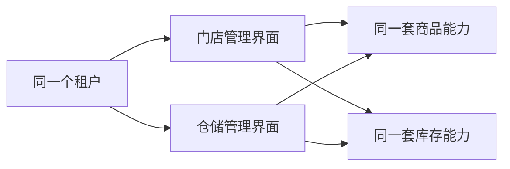

# Peanut Admin 自然语言确认预览

> 这份文件不要求理解架构术语。
>
> 状态：Superseded by `49-post-calibration-coding-approval-preview.md`。本文保留首轮方向说明，当前放行请读取 49 号文档。

## 1. 用户怎样进入系统

一个人先用邮箱登录，系统找到他的唯一账号。

这个账号可能属于一家企业，也可能同时属于多家企业。系统列出他可以进入的企业；只有一家时自动进入，多家时由他选择。

进入后，系统取得的是“这个账号在这家企业里的成员身份”。角色、部门、菜单和数据权限都绑定在这个成员身份上，而不是直接绑在全局账号上。

```text
邮箱登录
-> 找到全局账号
-> 选择要进入的客户/经营单位
-> 找到该单位中的成员身份
-> 根据角色和数据权限工作
```

我们把“购买并使用系统、拥有独立数据的客户或经营边界”叫租户。一个简单项目也使用同一结构，只是系统初始化时只有一个租户，用户通常不用看见选择步骤。

## 2. 一个租户可以管理什么

一个租户可以有：

- 多个部门和员工。
- 多个门店。
- 多个仓库。
- 供应商、客户、配送点等后续业务对象。

门店、仓库和供应商不是租户。即使只有一家门店独立签约，租户仍是经营这家门店的公司或团队，门店记录仍建立在该租户之内。

一个租户可以同时有多个门店、多个仓库、多个供应商和其他类别的业务对象。一个成员也可以按权限同时管理同一类别中的多个目标，例如门店 A、B、C；具体能看什么、能改什么仍按每项功能分别判断。

因此，“集团下面有三家门店、两个仓库”第一版仍可作为一个租户。集团和子公司之间需要独立合同、权限或数据隔离时，再设计父子租户/协作关系，不能拿部门树假装解决。

## 3. 门店系统和仓储系统怎样共用数据

门店管理和仓储管理可以是两个不同界面，也可以分别部署前端，但它们不是两套重复的数据。



商品能力维护 Product/SKU。库存能力维护库存地点、余额和流水。

- 门店关联一个或多个库存地点。
- 仓库也关联一个或多个库存地点。
- 门店销售通过库存服务扣减门店库存。
- 仓库出库通过同一个库存服务扣减仓库库存。
- 调拨由库存服务在同一事务中完成一减一增并记录流水。

门店和仓库页面可以完全不同，但商品和库存事实各自只有一个所有者，不允许两套系统各存一份余额。

## 4. 模块、菜单和产品方案的区别

可以把模块理解成“一套真正负责某类数据和规则的能力”。例如库存模块负责余额、流水、增减和调拨。

菜单只是打开页面的入口。把“库存查询”菜单隐藏，不等于库存模块不存在，也不等于后端可以不校验权限。

产品方案是一张装配清单：

- 门店管理方案默认包含门店、商品、库存、销售、收银和配送。
- 仓储管理方案默认包含仓库、商品、库存、入库、出库、调拨和配送。

同一个模块可以同时出现在两个产品方案中。不是模块安装模块，也不是复制两份模块。

某人最终能使用一个功能，需要同时满足：

1. 当前部署已经安装该模块。
2. 当前租户已经开通该模块。
3. 当前成员拥有相应功能权限和数据权限。

## 5. 是否每个页面都必须选择门店或仓库

不需要。

租户隔离始终存在，保证不能看到其他租户的数据。在租户内部：

- 门店收银等页面可以固定当前门店，自动过滤门店数据。
- 运营分析页面可以不固定门店，通过查询条件选择一个或多个门店。
- 无论是否显示选择条件，后端数据权限都会限制该成员实际可访问的门店/仓库。

这实现了“门店端默认只看自己”和“运营端可以管理多个门店”，不需要为两种页面建立两套租户系统。

## 6. 三种容易混淆的运营平台

### 公司内部的平台管理端

用于创建、停用租户、查看系统状态和管理版本。平台操作员不能因为管理系统就自动读取所有客户业务数据。

### 真实经营企业的运营后台

如果某家公司自己管理多个门店和仓库，它就是普通租户。其员工通过角色和数据权限管理一个或多个门店，不需要平台超级权限。

### 官方代运营

如果我们的员工要跨多个独立客户租户代运营，必须由客户明确授权范围和期限，并完整审计。第一版先保留边界，实际委托模型放在后续阶段；不能拿客户账号登录，也不能让平台管理员静默越权。

## 7. 代码怎样放

第一阶段建议只有一个公开 GitHub 仓库，但内部有四个清楚的项目：

```text
peanut-admin/
├── backend/        可运行后端
├── frontend/       可运行管理前端
├── packages/php/   可复用后端核心包
└── packages/web/   可复用前端核心包
```

“放在同一个 Git 仓库”不等于混在一起。前后端仍可独立构建和部署，核心包也有独立依赖清单和公开接口。

这样做的原因是，核心接口尚未稳定时拆成三个仓库，会增加跨仓提交、版本匹配和发布成本。等 DCS、Finance Manager 等至少两个真实项目开始消费且接口稳定后，再决定是否拆成独立核心包仓。

私有 DCS、Finance Manager 和客户项目不放进 `peanut-opensource`，仍可使用 Gitee 私有仓。

## 8. 旧代码怎样处理

不把旧 `base-framework` 直接改名后公开。

推荐流程是：

1. 冻结旧仓并检查许可证、密钥和内部业务信息。
2. 对旧资产逐项标记保留、重写或丢弃。
3. 创建干净的 `peanut-admin` 仓库。
4. 只迁移确认过的设计和代码。
5. 新仓稳定后，把旧目录改名为 `base-framework-legacy` 只读保留。

## 9. 第一版不是一次做完所有后台功能

第一阶段 P0 先完成不会串租户的安全内核、账号登录、租户成员、权限、数据权限、模块开通、审计和最小管理界面。

第二阶段 P1 再补手机号、邀请、岗位、配置、字典、文件、任务、导入导出、代码生成器、插件和完整开发手册，达到普通开发者拿来可用的程度。

这不是缩小最终目标，而是先验证最难返工的租户、权限和模块边界，再补成熟后台功能。

## 10. 只需要回答四组

可以按下面格式确认：

```text
A 旧仓处理：同意干净重建 / 修改为……
B 代码组织：同意先用单一 monorepo / 修改为……
C 业务模型：同意唯一租户根、租户管理多对象、门店仓储共享模块 / 修改为……
D 推进顺序：同意先详细设计和 P0 安全内核，再做 P1 可用后台 / 修改为……
```

四组确认后，下一步仍然只会写字段、状态、接口、权限算法和测试矩阵。只有再次获得“开始 P0-A 运行时代码”的明确批准，才会创建真实代码仓并编码。
